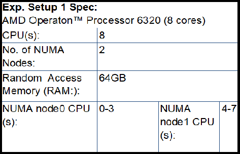

# Sequential and Parallel implementation of Minimax AI Search in a game 
# of Tictactoe on a 7x7 squared grid
Lewis Sharpe (ls68@hw.ac.uk) August 2018
## Purpose:
The implementation contains two versions of the same Minimax AI 
algorithm playing against each other in a game of tictactoe. The 
purpose of this parallel implementation of a minimax algorithm was to 
improve speed up in game decision-making. Figure 1 shows the scoring 
function for one path in the entire tree search. The Minmax algorithm 
would look to maximise the score generated in shorter number of moves 
and at a lower depth level.  **Figure 1:** 
Explaination of algorithm's procedure of defining a win in one path of 
the entire tree space.
## Minimax Algorithm:
The Minimax Algorithm focuses on the procedure of choosing the strategy 
that least benefits the most advantaged member of a group.
## Description of implementations:
### Sequential:
The sequential version of the game is coded in C, and is currently 
fixed on 7x7 squared grid. The algorithm plays the same AI against the 
AI we have designed. The possible playing characters that could apprear 
on my board are the following: - 'X' - Player 1 playing marker - 'O' - 
Player 2 playing marker - '|' - Segementation fault, invalid move - '-' 
- Empty square marker. The main features of the Minimax algorithm are 
the following: The algorithm embeds recursive function calling, as such 
the MinMax method will search and call again and again through tree to 
maximise score of the potential move, through the utilisation of a for 
loop the size greater of 0 to the number of remaining moves on the 
board. A Minimax will perform on each move visited and a score will be 
generated for each move. After each move, the 'bestScore' function will 
be assessed and, if the current move being searched through the tree 
beats the current best score achieved elsewhere found in the tree, the 
'bestScore' variable will be updated to this score. If the current move 
doesn't not beat the 'bestScore' value, the original 'bestScore' will 
be returned. The algorithm will generate a tree for all moves for 
either side, ply (Player 1) or opp (Player 2), and thus then search and 
check if there is a win for either player after each move through the 
use of the 'EvalForWin', 'ThreeInARow' and 'ThreeInARowAllBoard' 
functions. The algorithm will always look for a winning move, and if a 
winning move is not, the next best move will be looked for, with 
priority place for move in the middle of the board, if middle is not 
available then priority will be placed on the corners of the board, and 
if the corners are not available, then the algorithm will make a random 
move
### Parallel:
Parallel variants of the sequential algorithm were implemented using 
shared memory programming paradigms OpenMP and PThreads. The individual 
aspects of each implementation are described below. **PThreads:** - 
definition of 'NUM_THREADS' construct which sets the number of threads 
avaible to the execution of the program; - implementation of the void 
argument '*thr_func', which handles the execution of the game on both 
side, and execution with the specified number of threads exemplified in 
the 'NUM_THREADS' construct; - creation of thread argument struct for 
the thr_func - creation of thread argument data array for NUM_THREADS; 
- implementation of threads over loop using 'pthread_create' procedure; 
- utilisation of the 'pthread_join' procedure which blocks execution 
until all threads complete. **OpenMP:** - definition of 'NUM_THREADS' 
construct which sets the number of threads available to the execution 
of the program; - utilisation of 'omp parallel for' construct over the 
integer value specified from the construct 'NUM_THREADS'; - the use of 
the 'omp_get_thread_num()' construct gives a integer value for specific 
number thread performing the current execution; - utilisation of 'omp 
parallel sections' and 'omp section' constructs allow segements of work 
in the algorithm to be done parallel .
## How to compile files:
### Sequential:
	      (through gcc) compile: gcc -o ttt ttt.c
			    execute: ./ttt
              (through bash script) compile and execute: sbatch bash.sh
				    view output generated: nano 
output.txt
              (through bash script that executes an iteration of 
specified runs of continous execution of the same algorithm to a newly 
created .out file)
                                    compile and execute: sbatch 
sepnumbat.sh
                                    view output generated: see 
generated .out file
             
### OpenMP:
              (through gcc) compile: gcc -o ttt ttt.c
			    execute: ./ttt
              (through bash script that executes an iteration of 
specified runs of continous execution of the same algorithm to 
output.txt) compile and execute: sbatch bash.sh
	                             view output generated: nano 
output.txt
              (through bash script that executes an iteration of 
specified runs of continous execution of the same algorithm to a newly 
created .out file)
                                    compile and execute: sbatch 
sepnumbat.sh
                                    view output generated: see 
generated .out file
### PThreads:
	      (through gcc) compile: gcc -o ttt_pt ttt_pt.c -lpthread
			    execute: ./ttt_pt
              (through bash script that executes an iteration of 
specified runs of continous execution of the same algorithm to 
output.txt) compile and execute: sbatch bash.sh
				    view output generated: nano 
output.txt
              (through bash script that executes an iteration of 
specified runs of continous execution of the same algorithm to a newly 
created .out file)
                                    compile and execute: sbatch 
sepnumbat.sh
                                    view output generated: see 
generated .out file
## Utilisation of Experimental Hardware Setups
The above variants of the Minimax Algorithm implemented were ran on the 
following shared memory machines with their specifications presented 
below. **Experimental Setup 1 - AMD OperatonTM Processor 6320 (8 core 
machine) hardware specification:**  
**Experimental Setup 2 - AMD OperatonTM Processor 6438 (48 cores) 
hardware specification:** 
